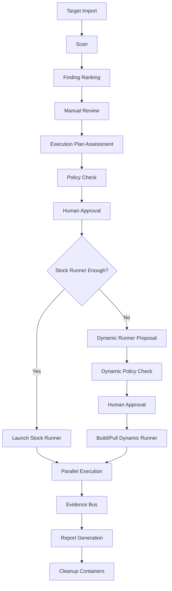

# HawkWing External Range AI Workbench 项目全面说明

## 1. 项目定位

HawkWing External Range AI Workbench，中文名为“鹰翼外部靶场 AI 攻防工作台”，是一套面向授权外部靶场、网络攻防比赛和蓝队教学演练的 AI 辅助攻防平台。

平台主要服务对象：

```text
蓝队队员
教员
裁判人员
靶场演练组织者
```

核心目标：

```text
导入外部临时靶场目标
自动完成资产发现和漏洞排序
人工复核后生成执行计划
按计划启动不同类型临时 Runner 容器
支持并行验证和证据采集
通过共享状态总线沉淀过程数据
自动生成整体渗透测试报告
任务结束后释放临时容器
```

本项目仅面向授权靶场和比赛环境使用。不得用于未授权目标。

---

## 2. 核心设计思想

平台不是一个简单扫描器，也不是一个直接全自动攻击工具，而是一个：

```text
AI 辅助分析
+ 人工审批
+ 临时容器执行
+ 证据沉淀
+ 报告生成
+ 可审计流程
```

的综合工作台。

关键原则：

```text
主框架只做控制、编排、审计、AI、报告
安全工具不直接堆在 API 主容器中
工具按类型拆分为多个 Runner 镜像
每次验证任务使用临时容器
容器结束后收集证据并释放
AI 可以规划，但执行前需要人工确认
复杂题目允许动态 Runner 提案，但必须策略检查和人工审批
```

---

## 3. 总体流程

```text
创建工作空间
-> 导入外部靶场目标
-> 启动标准扫描
-> 生成漏洞排行
-> 人工选择需要复核的漏洞
-> AI 执行计划评估
-> 人工审批执行计划
-> 启动存量 Runner 或动态 Runner
-> 并行执行验证任务
-> 写入共享状态和证据目录
-> 生成整体报告
-> 释放临时容器
```

流程图：



---

## 4. 技术架构

当前项目采用：

```text
FastAPI 后端
React/Vite 前端
Celery 任务队列
Redis 消息队列
PostgreSQL 数据库
Docker 临时 Runner 容器
Markdown 报告生成
OpenAI-compatible AI API 接口
```

服务组成：

```text
web                 前端控制台
api                 FastAPI 后端
worker-scan         扫描任务 Worker
worker-pentest      验证/渗透任务 Worker
postgres            结构化数据存储
redis               Celery broker/result backend
runner-*            临时工具容器镜像
```

---

## 5. 项目目录结构

```text
hawkwing-workbench/
  apps/
    api/                     FastAPI 后端、Celery Worker、AI 接口
    web/                     React/Vite 前端

  config/
    scope.template.yaml       临时靶场范围配置模板
    scan-policy.yaml          扫描策略模板
    tools.yaml                早期工具配置
    tool-catalog.yaml         工具目录和风险分级
    runner-profiles.yaml      Runner Profile 注册表
    skill-registry.yaml       AI Skill / Runbook 注册表
    dynamic-runner-policy.yaml 动态 Runner 策略
    evidence-bus-schema.yaml  共享状态/证据总线规范
    report-template.md        报告模板

  runners/
    _shared/                  Runner 共享入口脚本
    runner-recon-basic/       侦察 Runner
    runner-web-basic/         Web 基础验证 Runner
    runner-web-advanced/      Web 高级验证 Runner
    runner-traffic-basic/     流量分析 Runner
    runner-ad-basic/          AD 枚举 Runner
    runner-linux-privesc/     Linux 提权枚举 Runner
    runner-windows-privesc/   Windows 提权枚举 Runner
    runner-forensics-basic/   取证 Runner
    runner-pwn-rev-basic/     Pwn/逆向 Runner
    runner-cloud-container-basic/ 云/容器 Runner
    runner-report/            报告 Runner

  deploy/
    docker-compose.yml        一键部署配置
    .env.example              环境变量模板

  data/
    artifacts/                任务证据
    reports/                  报告输出
    workspaces/               工作空间中间数据

  docs/
    architecture.md           架构说明
    deployment.md             部署说明
    user-guide.md             使用说明
    runner-plugin-guide.md    Runner 插件开发说明
    advanced-orchestration.md 高级编排说明

  README.md
  项目全面说明.md
```

---

## 6. 后端核心模块

后端位于：

```text
apps/api/app/
```

主要文件：

```text
main.py                       API 路由入口
models.py                     数据库模型
schemas.py                    请求/响应模型
config.py                     配置读取
db.py                         数据库初始化

services/ai_client.py         AI API 适配器
services/catalog.py           工具/Runner/Skill 配置读取
services/execution_planner.py 执行计划评估
services/dynamic_builder.py   动态 Runner 策略检查和提案
services/runner.py            Docker Runner 管理
services/state_bus.py         共享状态事件写入
services/reporting.py         报告生成

workers/celery_app.py         Celery 应用
workers/tasks.py              扫描和验证任务
```

---

## 7. 数据模型

当前核心数据表：

```text
workspaces
targets
findings
scan_jobs
pentest_jobs
evidence_files
audit_logs
execution_plans
workspace_state_events
attack_path_nodes
attack_path_edges
```

说明：

```text
workspaces
一次外部靶场任务或比赛任务。

targets
导入的 IP、CIDR、域名、URL。

findings
扫描和验证过程中产生的漏洞或可疑发现。

execution_plans
人工复核后由 AI/规则生成的容器执行计划。

pentest_jobs
实际启动的 Runner 验证任务。

workspace_state_events
共享状态总线事件，用于多容器之间间接交换信息。

attack_path_nodes / attack_path_edges
后续用于表达攻击路径、资产关系、权限关系。
```

---

## 8. API 能力

基础接口：

```text
GET  /api/health
GET  /api/ai/config
POST /api/ai/analyze
```

工作空间：

```text
POST /api/workspaces
GET  /api/workspaces
GET  /api/workspaces/{workspace_id}
```

目标导入：

```text
POST /api/workspaces/{workspace_id}/targets/import
GET  /api/workspaces/{workspace_id}/targets
```

扫描和漏洞：

```text
POST /api/workspaces/{workspace_id}/scan/start
GET  /api/workspaces/{workspace_id}/findings
```

执行计划：

```text
POST /api/workspaces/{workspace_id}/execution-plans/assess
GET  /api/workspaces/{workspace_id}/execution-plans
GET  /api/execution-plans/{plan_id}
POST /api/execution-plans/{plan_id}/approve
POST /api/execution-plans/{plan_id}/execute
```

Runner 任务：

```text
POST /api/workspaces/{workspace_id}/pentest/batch
GET  /api/workspaces/{workspace_id}/pentest-jobs
```

工具和策略：

```text
GET  /api/tools/catalog
GET  /api/runners/profiles
GET  /api/skills
GET  /api/policies/dynamic-runner
POST /api/workspaces/{workspace_id}/tools/run
```

报告和审计：

```text
POST /api/workspaces/{workspace_id}/report/generate
GET  /api/workspaces/{workspace_id}/report/download
GET  /api/workspaces/{workspace_id}/audit-logs
GET  /api/workspaces/{workspace_id}/state-events
```

---

## 9. AI API 配置

AI 配置位于：

```text
deploy/.env
```

示例：

```env
AI_PROVIDER=openai-compatible
AI_API_BASE=https://api.example.com/v1
AI_API_KEY=replace-with-your-key
AI_MODEL=gpt-4.1-mini
AI_TIMEOUT_SECONDS=60
```

当前 AI 接口采用 OpenAI-compatible Chat Completions 风格：

```text
POST {AI_API_BASE}/chat/completions
Authorization: Bearer {AI_API_KEY}
```

如果未配置 AI Key，平台仍可运行，执行计划会走规则评估和默认提示。

---

## 10. Tool Catalog 工具目录

工具目录位于：

```text
config/tool-catalog.yaml
```

设计目标：

```text
记录工具名称
记录工具版本
记录工具分类
记录风险等级
记录默认状态
记录所属 Runner Profile
```

工具状态：

```text
enabled    默认可用
approval   需要人工确认
disabled   默认禁用
```

本项目参考了 `Z4nzu/hackingtool` 的大工具库思路，但不是直接整包引入，而是做了筛选和风险分级。

默认不纳入存量 Runner 的类别：

```text
DDoS 工具
钓鱼工具包
RAT 框架
Payload 生成类高风险工具
不受控后渗透工具
```

---

## 11. Runner Profile 存量镜像库

Runner Profile 位于：

```text
config/runner-profiles.yaml
```

当前存量类型：

```text
runner-recon-basic
runner-web-basic
runner-web-advanced
runner-traffic-basic
runner-ad-basic
runner-linux-privesc
runner-windows-privesc
runner-forensics-basic
runner-pwn-rev-basic
runner-cloud-container-basic
runner-dynamic
```

各 Runner 用途：

```text
runner-recon-basic
用于资产发现、端口识别、DNS、Web 指纹。

runner-web-basic
用于 Web 爬取、目录发现、模板漏洞验证。

runner-web-advanced
用于需要审批的 Web 深度验证。

runner-traffic-basic
用于 pcap、流量和 IDS 规则分析。

runner-ad-basic
用于授权 AD 靶场中的枚举和攻击路径采集。

runner-linux-privesc
用于 Linux 提权枚举。

runner-windows-privesc
用于 Windows 提权枚举。

runner-forensics-basic
用于内存、磁盘、固件、文件取证。

runner-pwn-rev-basic
用于 Pwn 和逆向题支撑。

runner-cloud-container-basic
用于云、容器、SBOM、K8s 检查。

runner-dynamic
用于特殊题目中的动态镜像提案。
```

---

## 12. AI Skill / Runbook 体系

Skill 注册表位于：

```text
config/skill-registry.yaml
```

每个 Skill 记录：

```text
任务名称
适用 Runner
风险等级
是否需要审批
允许工具
输出 Schema
Runbook 步骤
```

当前 Skill 包括：

```text
external-recon
web-validation
advanced-web-validation
internal-network-recon
ad-enumeration
linux-privesc-enum
windows-privesc-enum
traffic-forensics
file-memory-forensics
pwn-reverse-support
dynamic-runner-build
```

作用：

```text
帮助 AI 理解什么任务该用什么 Runner
帮助执行计划评估选择合适工具
帮助报告生成统一描述过程
帮助裁判复核平台行为
```

---

## 13. 执行计划评估

执行计划评估发生在：

```text
漏洞扫描
-> 人工复核
-> 选择漏洞
-> 执行计划评估
```

评估内容：

```text
需要启动几个容器
每个容器使用哪个 Runner Profile
每个容器访问哪些目标
预计使用哪些工具
风险等级
是否需要审批
是否需要动态镜像
并发限制
```

示例输出：

```json
{
  "recommended_parallelism": {
    "total_containers": 3,
    "max_parallel": 3,
    "per_target_limit": 1,
    "high_risk_max": 1
  },
  "containers": [
    {
      "runner_type": "stock",
      "runner_profile": "runner-web-basic",
      "image": "hawkwing-runner-web-basic:latest",
      "tools": ["nuclei", "ffuf", "katana"]
    }
  ],
  "dynamic_images": []
}
```

---

## 14. 动态 Runner 策略

动态 Runner 策略位于：

```text
config/dynamic-runner-policy.yaml
```

动态 Runner 适用场景：

```text
固件题
IoT 题
Android/APK 分析
ICS 协议分析
特殊逆向工具
主 Runner 不包含的临时工具组合
```

默认策略：

```text
优先使用存量 Runner
允许 AI 生成动态镜像提案
允许生成 Dockerfile
允许拉取外部镜像
必须人工审批
禁止 privileged
禁止 Docker socket
禁止 host network
禁止 curl | bash
限制 CPU、内存、进程数和超时
保留 Dockerfile 和构建日志
```

动态 Runner 流程：

```text
AI 生成提案
-> 策略检查
-> 人工确认
-> 构建或拉取镜像
-> 临时执行
-> 收集证据
-> 清理容器
```

当前实现为“策略和提案骨架”，默认不会绕过人工审批直接执行动态构建。

---

## 15. 共享状态和证据总线

共享状态规范位于：

```text
config/evidence-bus-schema.yaml
```

目的：

```text
同一个目标上的多个 Runner 容器不直接互相读写
所有信息通过平台统一沉淀
保证审计、复盘和报告一致性
```

共享信息包括：

```text
asset.discovered
service.discovered
finding.created
finding.confirmed
evidence.created
credential.reference.created
session.reference.created
attack_path.node.created
attack_path.edge.created
execution_plan.created
runner.started
runner.completed
runner.cleaned
```

证据目录规范：

```text
/out/result.json
/out/commands.log
/out/timeline.json
/out/stdout.log
/out/stderr.log
/out/evidence/http
/out/evidence/screenshots
/out/evidence/files
/out/evidence/pcap
/out/evidence/forensics
```

---

## 16. 临时 Runner 容器

Runner 容器必须遵守输入输出协议。

输入：

```text
/out/input.json
```

示例：

```json
{
  "workspace_id": 1,
  "job_id": 2,
  "target": "10.10.10.5",
  "finding_id": 3,
  "mode": "controlled_validation"
}
```

输出：

```text
/out/result.json
/out/commands.log
/out/timeline.json
/out/evidence/
```

Runner 执行结束后：

```text
平台收集日志
平台记录 container_id
平台写入 workspace_state_events
平台释放容器
```

---

## 17. 前端工作台

前端位于：

```text
apps/web/
```

当前页面能力：

```text
创建工作空间
导入目标
启动标准扫描
查看漏洞排行
选择漏洞
填写场景说明
生成执行计划
审批执行计划
执行计划
查看 Runner Jobs
生成 Markdown 报告
查看 AI/工具/Runner/Skill 配置状态
```

访问地址：

```text
http://localhost:3000
```

---

## 18. 部署方式

推荐环境：

```text
Ubuntu Server 24.04 LTS
或 Windows 11 + WSL2 Ubuntu 24.04
Docker Engine 29.x
Docker Compose Plugin
CPU 8 核以上
内存 16 GB 以上
磁盘 500 GB SSD
```

启动：

```bash
cd hawkwing-workbench/deploy
cp .env.example .env
docker compose --profile build-runners build
docker compose up
```

访问：

```text
Web 控制台：http://localhost:3000
API 文档：http://localhost:8000/docs
健康检查：http://localhost:8000/api/health
```

如果只验证平台控制面：

```bash
docker compose up --build
```

如果比赛前预构建全部 Runner：

```bash
docker compose --profile build-runners build
```

---

## 19. 当前实现状态

已完成：

```text
项目目录
Docker Compose 部署
FastAPI API
React 前端
PostgreSQL/Redis/Celery
AI API 配置接口
工具目录
Runner Profile
Skill Registry
动态 Runner 策略
共享状态事件模型
执行计划评估/审批/执行 API
多类 Runner Dockerfile
报告模板升级
部署和高级编排文档
```

当前仍属于骨架或待深化：

```text
扫描任务目前仍是示例发现生成，需要接入 runner-recon-basic 的真实输出解析
Runner 入口脚本目前保持统一占位流程，需要逐类接入真实授权工具流程
动态 Runner 目前是策略提案骨架，尚未真正执行构建
攻击路径图谱模型已建立，但尚未做图谱推理和可视化
证据文件哈希和 MinIO 对象存储尚未完整接入
MCP Facade 尚未实现
```

---

## 20. 安全控制

当前设计内置以下安全思想：

```text
工具按风险分级
高风险工具需要人工审批
禁用 DDoS、钓鱼、RAT 等类别
AI 不能直接绕过策略执行命令
动态镜像需要策略检查和人工确认
Runner 容器默认非 privileged
不允许挂载 Docker socket 到 Runner
Runner 输出必须结构化
任务过程写入审计日志
任务状态写入共享状态事件
报告保留执行记录
```

建议后续增强：

```text
更严格的目标范围校验
按目标限速和锁机制
Secret Vault
证据文件 SHA256 校验
MinIO 证据对象存储
Kubernetes Job 替代本地 Docker Runner
Runner 网络隔离策略
镜像签名和 SBOM
```

---

## 21. 后续开发建议

建议按以下顺序继续开发：

```text
1. 接入 runner-recon-basic 的真实扫描输出解析。
2. 接入 runner-web-basic 的 nuclei/httpx/ffuf/katana 工作流。
3. 完善 EvidenceFile 哈希、文件索引和下载接口。
4. 将 ExecutionPlan 与前端展示进一步细化。
5. 接入 runner-forensics-basic 的 pcap/文件分析工作流。
6. 接入 runner-ad-basic 的授权 AD 枚举结果解析。
7. 增加 Secret Vault 和 Session Registry。
8. 增加 Attack Path Graph 可视化。
9. 实现 Dynamic Runner Builder 的真实构建/拉取能力。
10. 增加 MCP Facade，让 AI 通过受控工具网关调用平台能力。
```

---

## 22. 使用注意事项

```text
仅在授权外部靶场和比赛范围内使用。
比赛前应提前构建 Runner 镜像。
离线环境应提前缓存系统包、Python 包、Go 工具和模板库。
高风险 Runner 默认需要人工审批。
动态 Runner 不应绕过策略引擎。
报告可作为 writeup 初稿，但建议队员补充个人分析。
裁判可通过审计日志、状态事件和证据目录复核过程。
```

---

## 23. 项目价值

HawkWing 的价值在于：

```text
提升蓝队队员面对外部临时靶场的分析效率
把漏洞发现、人工复核、执行计划和验证过程串成闭环
让不同类型题目可以用不同 Runner 镜像高效处理
让综合题中的 Web、内网、取证、提权、逆向能够协作
让 AI 参与规划和报告，但不越过人工审批
让裁判具备可复核的证据链和任务记录
让赛后复盘和教学沉淀更系统
```

最终目标是形成一套可靠、可扩展、可审计、适合比赛和教学的外部靶场 AI 攻防工作台。

---

## 24. 内网综合题边界与可视化增强

内网综合题常见环节包括：

```text
Web 入口验证
权限证明
主机枚举
提权线索发现
AD 枚举
流量/文件取证
代理/隧道链路说明
攻击路径复盘
```

平台当前新增的安全支持能力：

```text
阶段可视化：Targets、Scan、Review、Plan、Execute、Evidence、Sessions、Report。
证据索引：Runner 完成后自动索引证据文件并计算 SHA256。
会话登记：记录经审批的 pivot/proxy/session 元数据、审批引用和说明。
WebShell 检测：支持检测和证据复核，不生成或投放 WebShell。
受控权限证明：使用非恶意 proof marker 和证据记录证明访问结果。
提权枚举：支持 Linux/Windows 提权线索枚举，不默认执行提权利用。
```

明确不默认支持的能力：

```text
冰蝎/哥斯拉 WebShell 木马生成
WebShell 自动投放
持久化木马部署
绕过人工审批的自动提权利用
绕过平台登记的隐蔽反向代理
```

推荐替代方案：

```text
使用 webshell-detection Skill 做检测和证据复核。
使用 controlled-access-proof Skill 生成非恶意证明材料。
使用 pivot-session-registration 记录经审批的隧道/代理元数据。
使用 runner-linux-privesc / runner-windows-privesc 做提权枚举。
将真实比赛中的链路、凭据引用、证明文件写入共享状态和报告。
```

新增接口：

```text
GET  /api/workspaces/{workspace_id}/stage-summary
GET  /api/workspaces/{workspace_id}/evidence
POST /api/workspaces/{workspace_id}/sessions
GET  /api/workspaces/{workspace_id}/sessions
```

新增 Runner：

```text
runner-pivot-proxy
```

该 Runner 用于经审批的代理/隧道会话登记和代理感知验证支撑，不用于绕过审批自动建立隐蔽通道。
